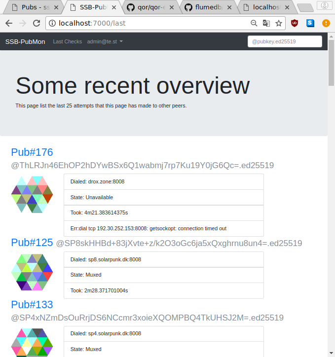

# ssb-pubmon

a botpage that periodically pings [secure scuttlebutt](https://www.scuttlebutt.nz/) pubs to monitor their livelyness.

# TODO

* make nice pie chart about uptime (last day/30 days)

## QOR maintainance

* overwrite auth template
* instantiate own middleware
* don't use global default cookie secret

# Fork of QOR example application

see [qor-example](https://github.com/qor/qor-example).

## License

Released under the MIT License.

